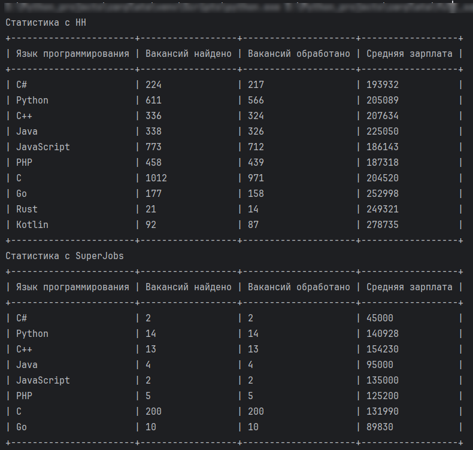

# Прикиньте будущую зарплату
Сравнение вакансий программистов
Данная программа собирает и анализирует информацию о вакансиях "программист" на платформах
[hh.ru](https://hh.ru) и [superjob](https://www.superjob.ru/) для популярных языков программирования.
Она выводит в таблицы количество вакансий за 30 дней и среднюю зарплату по каждому языку программирования.

## Установка и запуск

Python должен быть уже установлен.  
Скопируйте проект, создайте виртуальное окружение.  
Установите зависимости:

        pip install -r requirements.txt

Получите по [ссылке](https://api.superjob.ru/info/) секретный ключ. Создайте текстовый файл .env,
в который запишите следующее:

        SJ_SECRET_KEY==ваш_ключ_для_api

Запустите скрипт:

    $ python main.py

в терминал выведется примерно такая таблица:

## Цель проекта
Код написан в образовательных целях на онлайн-курсе для веб-разработчиков [dvmn.org](https://dvmn.org).